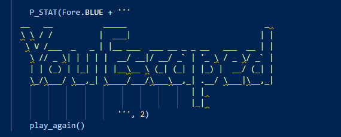

# The Great Castle Escape
## Designed and implemented by Stephen D'Arcy

# Table of Contents

1. [The Great Castle Escape](#The-Great-Castle-Escape)
   * [About](#About)
   * [The customer goals](#The-customer-goals)
2. [User Experience](#User-Experience)
   * [Project goals](#Project-goals)
   * [Design](#Design)
   * [User Stories](#User-Stories)
   * [Target Audience](#Target-Audience)
3. [Features](#Features)
   * [Home Page](#Home-Page)
4. [Technology Used In Design](#Technology-Used-In-Design)
   * [Python](#Python)
   * [Libraries](#Libraries)
5. [Testing](#Testing)
   * [User Stories](#User-Stories-Testing)
   * [Manual Testing](#Manual-Testing)
   * [Additional Testing ](#Additional-Testing)
6. [Deployment](#Deployment)
7. [Credits](#Credits)
   * [Code](#Code)
   * [Content](#Content)
8. [Bugs](#Bugs)

# Introduction

## About

* This a small interactive adventure game that challenges the player to try and escape from a castle. There is only one way out and
   many ways to die. We use a command line interface to let the user interact with the game. The user will make their decisions based 
   on the scenario they find them selves in and their decisions will ultimately win the game or lose the game.

## Main goals of the project

* To design a fun interactive game for players to enjoy while improving my understanding of the Python language in applications.

#### [Back to content](#table-of-contents)

# User Experience

## Design
* Flow chart for story lines

* The main design idea was to lead the user/player on a simple text adventure that will only have one winning outcome but many ways for the user/player
    to die. 

## User Stories

* As a user I would like to know what game I am playing
* As a user I want to be able to interact with the game.
* As a user I want to be able to distinguish between the choices I must make in the game.
* As a user I would want to know if I win or lose the game
* As a user I would like the option to play again or quit the game

## Target Audience

* The target audience for the game is everyone young and old who enjoy games and would like to test themselves and have fun doing so.

#### [Back to content](#table-of-contents)

# Features

## Home Page

* The home page is the only page on the application. It features a background image of a castle to make the program a bit 
   more immersive for the user. The terminal has been placed in the center of the screen for an easier visual experience. The button
   is located above the terminal and coloured so as to stick out to the player. 

*  Terminal design by The Code Institute

#### [Back to content](#table-of-contents)

# Technology Used In Design

- [Python](https://www.python.org/)
    - Python is the core programming language used to write all of the code in this application to make it fully functional.
    - In addition to core Python I have used the following Python modules:
        - [Colorama](https://pypi.org/project/colorama/)
            - Used to add colours to the printed terminal messages
        - [Time](https://docs.python.org/3/library/time.html)
            - Used for the timing functions to delay scripts being run.
        - [Random](https://docs.python.org/3/library/random.html)
            - Used for the random number generator.
- [GitHub](https://github.com/)
    - Used to store code for the project after being pushed.
- [Git](https://git-scm.com/)
    - Used for version control by utilizing the Gitpod terminal to commit to Git and Push to GitHub.
- [Gitpod](https://www.gitpod.io/)
    - Used as the development environment.
- [Heroku](https://dashboard.heroku.com/apps)
    - Used to deploy my application.
- [Visual Paradigm](https://www.visual-paradigm.com/)
    - Used to create the flowchart for the project.
- [Pep8](http://pep8online.com/)
    - Used to check my code against Pep8 requirements..
---

#### [Back to content](#table-of-contents)

# Testing

## User Stories Tested
## Manual Testing

* As a user I would like to know what game I am playing
    - The game will open up a terminal window in the Heroku application with the title of the game on top. 

## 
* As a user I want to be able to interact with the game.
    - The player will be asked to input their name. Once this has been done they will move on. If they enter nothing the game will prompt them 
       to input their name and will only proceed when this input is completed.

## 
* As a user I want to be able to distinguish between the choices I must make in the game.
    - The players choices will be clearly marked in yellow text for clarity and they will be given a choice of Y or N or other options when required.
      If a wrong character is input this will raise an error.

## 
* As a user I would want to know if I win or lose the game
    - The player will be given a text alert on screen along with a visual ASCII art design to alert them to the result of their current game.

## 
* As a user I would like the option to play again or quit the game.
    - The player will after wining or losing the game be given a choice to play again or not. If they decide not to play or play
      again the game will finish.

## 

## Additional Testing

# PEP8 Testing
## 
## 
## 

# Deployment

### Gitpod and GitHub

To use the terminal designed by The Code Institute I used the [Code Institute Python Essentials Template](https://github.com/Code-Institute-Org/python-essentials-template).
This allows the code that is used to run the terminal be viewed in the browser.

### Steps:

* Click create new repository.
* Give the repository a name.
* Under Repository template pick the [Code Institute Python Essentials Template](https://github.com/Code-Institute-Org/python-essentials-template).
* Click create repository
- Use GIT ADD .
- GIT COMMIT -m "Comments"
- GIT PUSH
- To commit the code and push to Github

### Creating an Application with Heroku

I used the video tutorial provided by The Code Institute to create a Heroku account, add the details of the app and deploy the application to a live environment.

- Log in to Heroku [Heroku](https://dashboard.heroku.com/)
- Click New 
- Give the app a name and choose the region
- Click on settings first and set the Reveal Config Vars
- PORT  = Key 8000 = Value
- If using CREDS please make sure this has been added to the requirements file.
- Add build pack include Python and Node.js
- The order of the buildpacks is important, in the list Python should be first with Node.js second. If they are not in this order, you can click and drag them to rearrange.
- Click Deploy at the top to go to the Deployment settings
- Choose GiHub as the deployment method
- Search for your app and connect
- Use Automatic deploys if you would like a new build when changes are pushed to GitHub from Gitpod
- Use Manual deploy for a new build every time this button is clicked.
- Once completed click View App

#### [Back to content](#table-of-contents)

# Credits

I owe thanks to:

* My mentor Miguel Martinez
* Ben Kavanagh's webinar on Python
* Deanna Sale for her help on centering the text in the terminal window. 

## Code

* All code has been written by Stephen D'arcy. Some inspiration was taken from W3 schools [W3 Schools](https://www.w3schools.com/python/)
* Stack overflow to learn how to use and initialize Colorama [Stack Overflow](https://stackoverflow.com/questions/49841315/how-to-clear-screen-using-colorama)
* I picked up advice and how to execute f strings with a class at [RealPython](https://realpython.com/python-f-strings/)

## Content

- [ASCII Art Castle](https://www.asciiart.eu/buildings-and-places/castles)
- [ASCII Art DEAD and Escaped and Game Over](https://ascii.co.uk/)

#### [Back to content](#table-of-contents)

# Bugs

* There was a bug present in the code, when a player decided to not play again there was a function running to put the player back to the middle of the game. This
was fixed by placing the function call to the correct indentation.

# Errors

* There are a total of 76 problems highlighted in the terminal.
* All the problems being highlighted are concerned with that ASCII and the placement of back and forward slash's.

#### [Back to content](#table-of-contents)